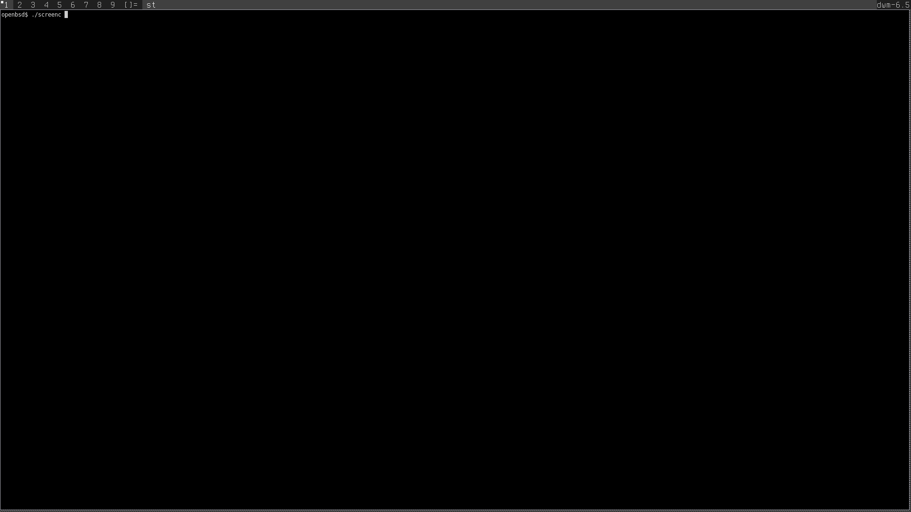
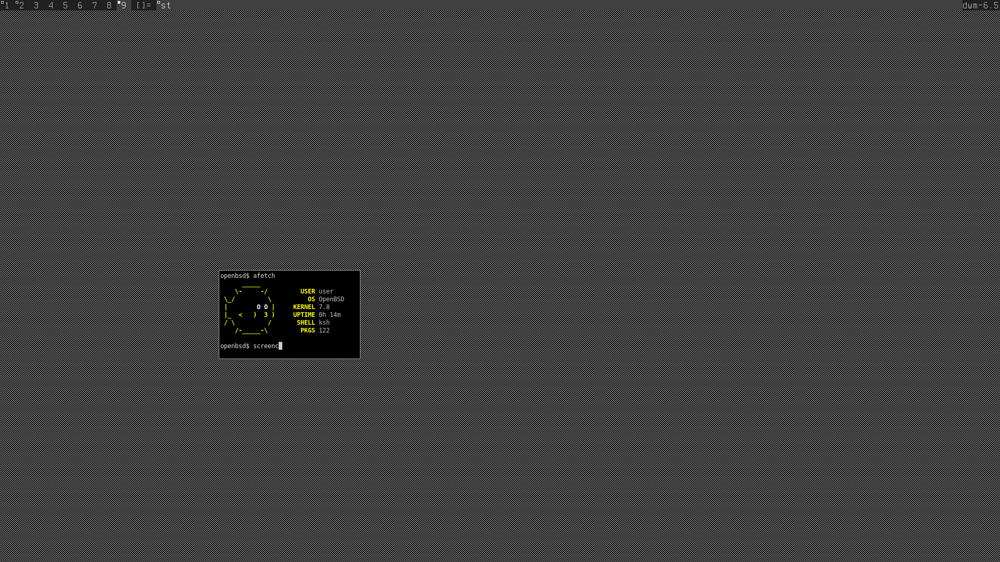

# screenc
A very simple C tool to create png screenshots. Requires only X11 and png libraries.

```bash
# usage:
chmod +x ./make.sh;
./make.sh build # or ./make.sh
./make.sh install
screenc                    # crop mode (default) - select area with mouse
screenc --full             # capture full screen
./make.sh clean            # delete compiled binary 
```

## Features
- **Crop mode (default)** - click and drag to select a crop area with a red rectangle overlay (fully transparent selection)
- **Full-screen capture** (`--full`) - captures the entire screen
- **Smart directory saving** - saves to current directory if writable, falls back to home directory
- **Fast and lightweight** - minimal dependencies (X11, libpng)
- **Automatic timestamped filenames** - format: `YYYY-MM-DD_HH-MM-SS.screenshot.png`

## Crop Mode
By default, screenc opens in crop mode. Click and drag to draw a red rectangle around the area you want to capture. The selection is fully transparent so you can see the screen behind it. Release the mouse to take the screenshot of the selected area.


